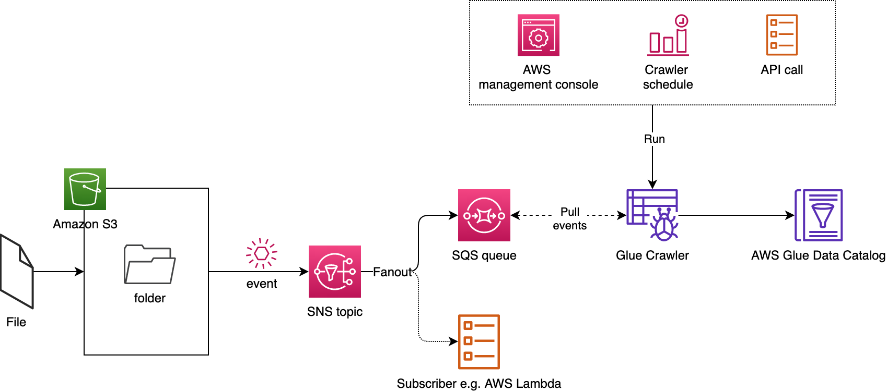

# AWS Glue Crawler - Utilities

This repository has a collection of utilities for [Glue Crawlers](https://docs.aws.amazon.com/glue/latest/dg/add-crawler.html). These utilities come in the form of [AWS CloudFormation](https://aws.amazon.com/cloudformation/) templates or [AWS CDK](https://aws.amazon.com/cdk/) applications.

## Contents

* [Amazon S3 event based Glue Crawlers](#amazon-s3-event-based-glue-crawlers)
  * [Deployment](#deployment)
  * [Testing](#testing)
* [Contributors](#contributors)
* [License Summary](#License-Summary)

---

## Amazon S3 event based Glue Crawlers

Figure below illustrates how this feature works.

---

### Deployment using Boto3

To be added

---

### Testing

Follow [AWS Blog]()

---

### Future enhancements

1. AWS CDK Application
2. CloudFormation template

---

## Contributors

1. **Ravi Itha**, Senior Data Architect, Amazon Web Services
1. **Pradeep Patel**, Senior Software Development Engineer, Amazon Web Services
1. **Vivek Shrivastava**, Senior Data Architect, Amazon Web Services

---

## License Summary

This sample code is made available under the MIT-0 license. See the LICENSE file.